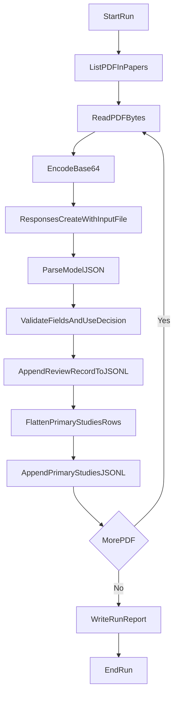

# Plan: Direct PDF-to-OpenAI Extraction Pipeline

## Goal
Implement a Python pipeline that sends each PDF in `./papers` directly to OpenAI using `input_file` (base64) and returns:
- one structured JSON record per review paper, and
- a structured list of cited papers as candidate primary studies.

## Required JSON Output Schema
Each extracted record must contain:

```json
{
  "title": "",
  "year": "",
  "type_of_paper": "",
  "population": "",
  "ai_type_application": "",
  "mental_health_outcome": "",
  "positive_effects": "",
  "negative_effects": "",
  "evidence_type": "",
  "main_finding": "",
  "limitations_bias": "",
  "relevance_to_our_review": "",
  "use_decision": "Include | Maybe | Exclude",
  "notes_for_research_question": "",
  "is_review_paper": true,
  "primary_studies": [
    {
      "study_title": "",
      "year": "",
      "authors": "",
      "doi_or_identifier": "",
      "why_relevant": ""
    }
  ],
  "primary_studies_count": 0,
  "source_file": ""
}
```

## Planned File Layout
- `/mnt/disk1/aiotlab/anhtn/systematic_review/src/review_extraction/config.py`
- `/mnt/disk1/aiotlab/anhtn/systematic_review/src/review_extraction/schema.py`
- `/mnt/disk1/aiotlab/anhtn/systematic_review/src/review_extraction/openai_client.py`
- `/mnt/disk1/aiotlab/anhtn/systematic_review/src/review_extraction/pipeline.py`
- `/mnt/disk1/aiotlab/anhtn/systematic_review/src/review_extraction/io_utils.py`
- `/mnt/disk1/aiotlab/anhtn/systematic_review/outputs/extractions.jsonl`
- `/mnt/disk1/aiotlab/anhtn/systematic_review/outputs/primary_studies.jsonl`
- `/mnt/disk1/aiotlab/anhtn/systematic_review/outputs/run_report.json`

## Processing Flow


## Implementation Steps
1. Build schema contract in `schema.py`
   - define all required keys
   - enforce `use_decision` in `Include`, `Maybe`, `Exclude`
   - define `primary_studies` item schema for cited papers

2. Build OpenAI PDF extraction client in `openai_client.py`
   - read PDF bytes
   - base64 encode
   - call `client.responses.create(...)` with:
     - `input_file` for the PDF
     - `input_text` prompt that asks for strict JSON only

3. Build prompt template for stable extraction
   - include all target fields
   - explicitly request cited primary-study list from references/body text
   - instruct model to return valid JSON only (no markdown, no prose)

4. Build batch pipeline in `pipeline.py`
   - iterate all `*.pdf` files in `./papers`
   - call extraction client for each file
   - write one JSON object per line into `outputs/extractions.jsonl`
   - flatten and write each primary study entry into `outputs/primary_studies.jsonl`

5. Build validation and recovery
   - parse model output as JSON
   - if invalid JSON or missing keys, retry once with repair prompt
   - log failures to `outputs/run_report.json`

6. Build run reporting
   - totals: processed, success, failed
   - per-file error details
   - optional token usage/cost if returned by API response

## Prompt Strategy (for next implementation)
- System instruction: extract as systematic-review assistant
- User input:
  - attached PDF file as `input_file`
  - strict extraction instruction
  - exact JSON schema template
- Expected output: one valid JSON object only, including `primary_studies` list

## Acceptance Criteria
- One command processes all PDFs in `./papers`
- `outputs/extractions.jsonl` contains one valid JSON record per successful PDF
- `outputs/primary_studies.jsonl` contains extracted cited studies with link back to source review paper
- Every JSON record includes all fields in your questionnaire
- `use_decision` is always `Include`, `Maybe`, or `Exclude`
- Failed files are captured in `outputs/run_report.json` without stopping whole batch

## Next Step
After you approve this plan, implementation starts with:
1) `schema.py` and prompt template,
2) OpenAI PDF call module using your direct file approach,
3) batch runner + JSONL writer.
